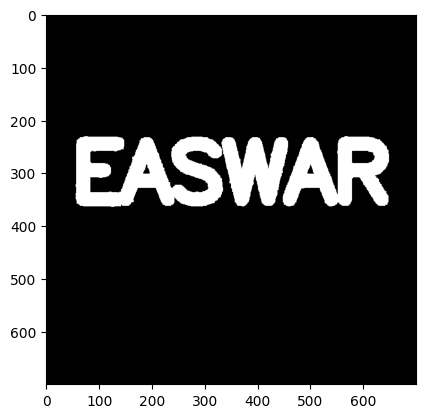
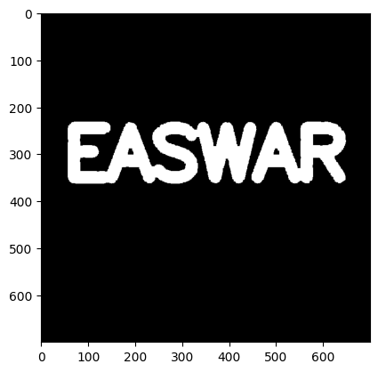

# IMPLEMENTATION-OF-OPENING-AND-CLOSING
# OPENING AND CLOSING

## Aim
To implement Opening and Closing using Python and OpenCV.

## Software Required
1. Anaconda - Python 3.7
2. OpenCV
## Algorithm:
### Step1:
Import the necessary packages

### Step2:
Create the Text using cv2.putText

### Step3:
Create the structuring element

### Step4:
Use Opening operation

### Step5:
Use Closing Operation
 
## Program:

```python
import numpy as np
import cv2
import matplotlib.pyplot as plt


def load_img():
    img =np.zeros((700,700))
    font = cv2.FONT_HERSHEY_SIMPLEX
    cv2.putText(img,text='HARI',org=(50,350), fontFace=font,fontScale= 4,color=(255,255,255),thickness=15,lineType=cv2.LINE_AA)
    return img
def display_img(img):
    plt.imshow(img,cmap='gray')
    plt.show()


img = load_img()
display_img(img)

kernel = np.ones((5, 5), dtype=np.uint8)
erosion1 = cv2.erode(img, kernel, iterations=1)
display_img(erosion1)
dilation=cv2.dilate(img,kernel,iterations=1)
display_img(dilation)

#OPENING

white_noise = np.random.randint(low=0, high=3, size=(700, 700), dtype=np.uint8)
white_noise = white_noise*255
noise_img = white_noise+img
opening = cv2.morphologyEx(noise_img, cv2.MORPH_OPEN, kernel)
display_img(opening)

#CLOSING

closing = cv2.morphologyEx(noise_img, cv2.MORPH_CLOSE, kernel)
display_img(closing)
```

## OUTPUT

### OPENING

### CLOSING


## Result
Thus the Opening and Closing operation is used in the image using python and OpenCV.